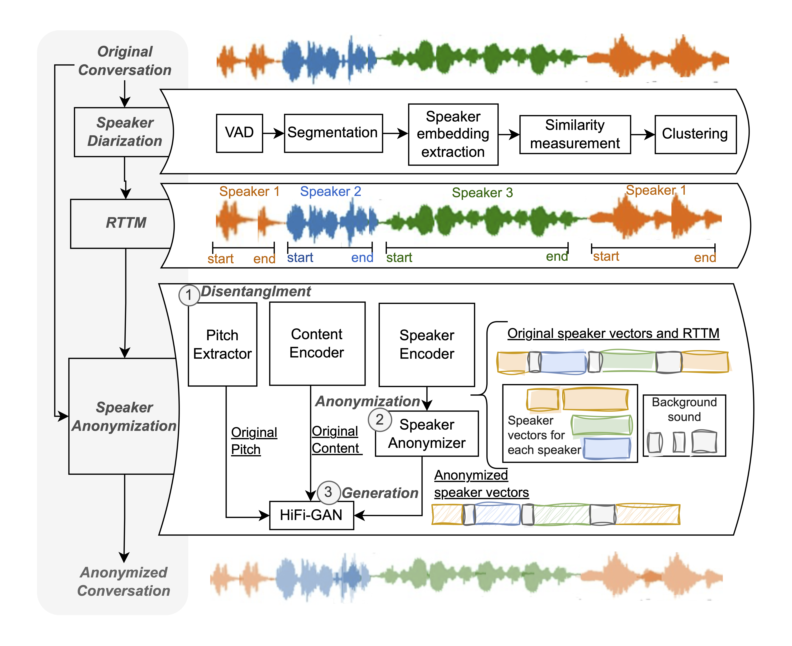

# MSA

## A Benchmark for Multi-speaker Anonymization 

This is an implementation of the paper - [A Benchmark for Multi-speaker Anonymization](http://arxiv.org/abs/2407.05608)

The authors are Xiaoxiao Miao, Ruijie Tao, Chang Zeng, Xin Wang.

Audio samples can be found here: https://xiaoxiaomiao323.github.io/msa-audio/

## Dependencies

`git clone https://github.com/xiaoxiaomiao323/MSA.git`

`cd MSA`

`bash install.sh`

`bash demo.sh`

## Instructions for aonymization for your own conversations

* Put your data under "data/wavs"
* [Optional] If you have real RTTMs, put it under "data/rttms" (only needed if you want to compute DERs)
* bash demo.sh 

## Acknowledgments
This study is partially supported by JST, PRESTO Grant Number JPMJPR23P9, Japan, SIT-ICT Academic Discretionary Fund, and Ministry of Education, Singapore, under its Academic Research Tier 1 (R-R13-A405-0005) and its SIT's Ignition grant (STEM) (R-IE3-A405-0005)
## License

The `anon/adapted_from_facebookreaserch` subfolder has [Attribution-NonCommercial 4.0 International License](https://github.com/xiaoxiaomiao323/MSA/blob/main/anon/adapted_from_facebookresearch/LICENSE). The `anon/adapted_from_speechbrain` subfolder has [Apache License](https://github.com/xiaoxiaomiao323/MSA/blob/main/anon/adapted_from_speechbrain/LICENSE). They were created by the [facebookreasearch](https://github.com/facebookresearch/speech-resynthesis/blob/main) and [speechbrain](https://github.com/speechbrain/speechbrain) orgnization, respectively. The `anon/scripts` and `anon
/anon_control` subfolder has the [MIT license](https://github.com/nii-yamagishilab/SSL-SAS/blob/main/scripts/LICENSE).

Because this source code was adapted from the facebookresearch and speechbrain, the whole project follows  
the [Attribution-NonCommercial 4.0 International License](https://github.com/nii-yamagishilab/SSL-SAS/blob/main/adapted_from_facebookresearch/LICENSE).

